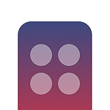

# Remocon
`Remocon` is an app based on Mac Catalyst (iOS, iPadOS and macOS) and controlls my living room.

## Build
- `pod install`
- `open Remocon.xcworkspace` and run Xcode
- `Build`

## License
`Remocon` is released under the MIT License.
